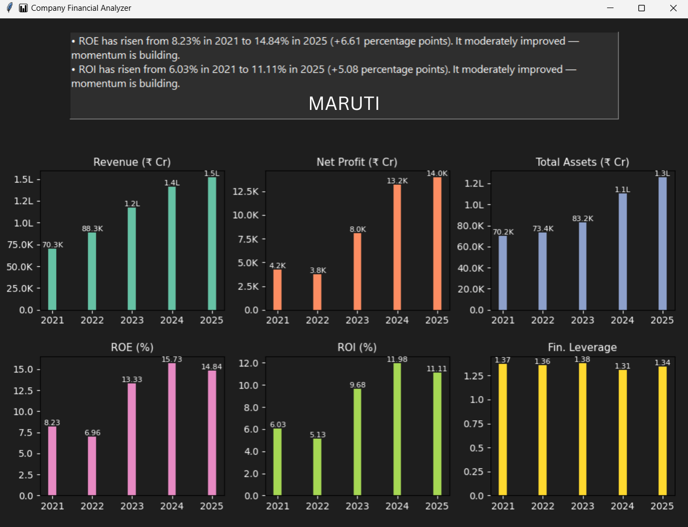

# 📊 Company Financial Analyzer

A powerful Python GUI tool that analyzes and visualizes financial metrics of Indian companies using real-time data from [Screener.in](https://www.screener.in). This tool provides smart, insightful feedback and clean visualizations to help understand a company's financial performance over time.

---

## 🚀 Features

✅ Input company slug (e.g., `TCS`, `INFY`)  
✅ Scrape and analyze data from Screener.in  
✅ Track:
- Revenue
- Net Profit
- Total Assets
- ROE (Return on Equity)
- ROI (Return on Investment)
- Financial Leverage

✅ Compare 2021 vs 2025 performance with intelligent feedback  
✅ Dark-themed interactive UI using Tkinter  
✅ Bar charts using Matplotlib

---

## 📸 Screenshots

### 🟦 Welcome Screen

### 🟦 Input Screen

### 🟦 Company: Asian Paints

### 🟦 Company: Maruti

### 🟦 Company: Reliance

